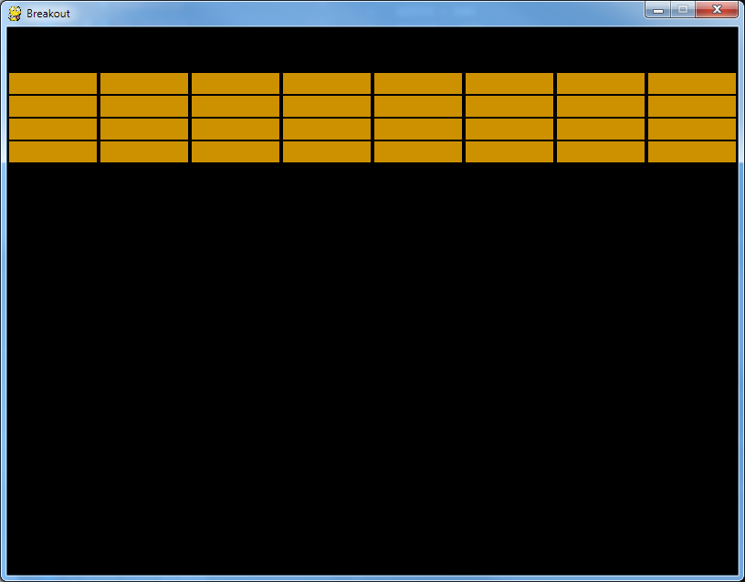

# Step 5 - Working with the blocks (rather long, I'm afraid)

The object of Breakout is to get the ball to destroy all the blocks at the top of the window while preventing the ball from going off the bottom of the window. This section is about how to draw the blocks and how they get destroyed if the ball hits them.

The blocks will be rectangle objects, and we will put all the blocks in a Python *list*.

#### 1. Make an empty list variable

First, add this in the same part of your code where other variables (like bat, ball) are created, and before all the functions:

```blocks = []```

This line makes an empty *list* variable called **blocks**, where the blocks will be stored. 

#### 2. Rectangle objects to put in the list

The blocks will be rectangles which are 96 pixels wide and 23 pixels high, and we want four rows of blocks, with eight blocks in each row. We want to space them out to leave a narrow gap between each of the blocks. The ideal spacing will be to have the first block with its top left corner at coordinates x = 2, y = 50, then have them spaced them out every 100 pixels going across, and every 25 pixels going down. 

We could make the blocks in the list individually, giving the coordinates and size for each one:
```
blocks[0] = Rect(2, 50, 96, 23)
blocks[1] = Rect(102, 50, 96, 23)
blocks[2] = Rect(202, 50, 96, 23)

up to ...

blocks[31] = Rect(702, 150, 96, 23)
```
but that would be a TERRIBLY tedious way of making them and very likely to produce errors. Much better is to use a Python **for** loop where Python automatically calculates the positions, creates the blocks and adds each new block into the list as it's created.

In fact, the best way of doing this is to use *two* **for** loops, with *one inside the other*. This is a common thing to do in coding. When loops are arranged one inside the other they are called *nested* loops.

#### 3. Calculating the coordinates for each block

We want to make 32 blocks arranged in four rows and eight columns. In Python we will number the rows from the top 0, 1, 2, 3, and the columns from the left 0, 1, 2, 3, 4, 5, 6, 7. We will use two variables: **block_row** for the row number and **block_col** for the column number.

The *outer* **for** loop will be for the row number, and the *inner* **for** loop will be for the column number. The outer loop begins with this code

```for block_row in range(4):```

This sets the value of **block_row** to 0, 1, 2, 3 in turn. As soon as we have set the row number we can calculate the y coordinate of the top of the row - as all the blocks in this row will have the same y coordinate. In section 2 (above) we said we wanted the top row to have a y coordinate of 50 and for this to increase by 25 for each row, so the y coordinates for the four rows will be 50, 75, 100, 125.

Now you need to write a little sum which makes use of the row number, and the row spacing (25), and the y coordinate for the first row (50) to produce this sequence of numbers. How would you do this? 

(Hint: it involves multiplication and addition.)

You can try out your calculation by writing a very simple Python programme (in a new file) and printing the results. This doesn't need pgzrun, you can just run it in normal Python. Put this code in a new file:
```
for block_row in range(4):
    block_y =         # here you put in your sum using block_row, and 25 and 50
    print(block_y)
```
Save the code and run it. If your calculations are right it will print the numbers 50, 75, 100, 125, each on a separate row. If it doesn't work first time keep adjusting your calculation until you get it to print the correct sequence. When you get this right you will have learned a key skill in using **for** loops.

The inner **for** loop begins with this code
```
    for block_col in range(8):
```
but make sure this line is indented from the outer **for** loop as this loop has to run *inside* the outer loop. This will set the variable **block_col** in turn to 0, 1, ..., 7. When we have set the column number we can calculate the x coordinate of the blocks in that column (because all blocks in the same column have the same x coordinate). For the x coordinates of columns 0 to 7 we want a sequence which goes 2, 102, 202, ..., 702. Use the column number, column spacing (100) and x coordinate for the first column (2) to write an almost identical sum which produces this sequence.  You can adapt the simple Python code above to check you have the correct sum.

#### 4. Use your calculations to make blocks on the screen

Before you set about adding your calculations for the x and y coordinates into the code for the game try editing the Python file at the top of this page called test_blocks.py. This is a segment of the Breakout game with just the code needed for the blocks. In your Python editor open a new file and copy and paste the code from test_blocks.py.

Add the code for your calculations in the lines which begin ```block_y =``` and ```block_x =``` then save the file and run it with ```pgzrun```. If your calculations are right the screen should look like this:



Look carefully at how the nested **for** loops are arranged in this code. The code which actually makes the block rectangle is in the *inner* for loop and begins ```block = Rect(``` and uses the results of your calculations for the coordinates of the block.

The line which starts ```blocks.append``` is explained below, in section 5.

The other line which is new is the line in function draw() which actually draws the blocks on the screen. That is explained below, in section 8.

#### 5. Adding the new block to the list of blocks (and how to remove a block from the list)

Every time we make a new block with the nested **for** loops we need to add it to the end of the list of blocks.

The Python method for adding an item on to the end of a list is **append()**. If we type this Python code:
```
my_list.append(new_item)
```
this will add the object called ```new_item``` onto the end of the list called ```my_list```. You will need to use this code but for a rectangle object called **block** which you want to add to the end of a list called **blocks**.

When the ball hits one of the blocks it destroys the block, so we need a way to *remove* a block from the list. There is another Python method for removing an item from a list, called **pop()**. If we type:
```
my_list.pop(unwanted_item)
```
it does two things - it removes ```unwanted_item``` from the list ```my_list``` and it shuffles all the other items in the list along so that there are no gaps in the list. 

Sometimes we only know the index number of the item we want to remove from the list. So if we wanted to remove the fourth item (which has index 3) from a list called my_list we would type:
```
my_list.pop(my_list[3])
```

#### 6. Adding the nested loops code to breakout.py

When you have the code in test_blocks.py working properly you can add the code for the nested **for** loops into your breakout.py code.

Copy the code in test_blocks.py from the line beginning ```for block_row``` up to and including the line beginning ```blocks.append(``` and paste this into breakout.py after the line ```blocks = []```.

#### 7. Destroying blocks when the ball hits them

A block (which is a rectangle object) will get destroyed when it gets hit by the ball (which is another rectangle object).

In [step 4](../step04-bat_on_ball) we saw the Pygame Zero function for checking if two rectangles are colliding. We could use this again to check if the ball was colliding with one of the blocks but we would have to check this for every single block. Luckily Pygame Zero has another function to check if a rectangle is colliding with any one of the rectangles in a list. The function is **collidelist()**.

We use this code:

`ball.collidelist(blocks)`

This checks if the ball is colliding with any rectangle in the list called blocks, and, if it is, it gives us the index number of the block which is in the collision. If the ball isn't colliding with any of the blocks it gives us the value -1. We can use this in an **if** statement. 

In breakout.py in the function update() there are already several if statements, so add this line under the other if statements (don't forget to indent it):

`    if ball.collidelist(blocks) >= 0:`


This will be ignored if there is no collision between the ball and a block, but if there is a collision it will give us the index number of the block which has been hit.

When a block is hit we want these things to happen:
 i) the block disappears - we do this by *removing* it from the list of blocks
ii) the y velocity of the ball gets reversed so the ball goes down if it was going up, or goes up if it was going down

Under the if statement add lines of code (indented) to carry out these two tasks. You should be able to work out how to do this from information on this page (see the bit about the pop() method in section 5 above) and in other bits of your code you have written already.

#### 7. Display the blocks

To draw the blocks on the screen we need to add some extra code in function draw(). The screen.draw.filled_rect() lines we have already written only draw a single rectangle (either the bat or the ball). Now we want code which will draw lots of rectangles (all the blocks) at the same time. This is done using another **for** loop. After the code to draw the bat and the ball add this (indented correctly, of course):
```
for block_to_draw in blocks:
    screen.draw.filled_rect(block_to_draw, GOLD)
```
This goes through the list called blocks and draws every block in the list, filled with the colour we defined by our tuple variable GOLD.

#### 8. Save and try out your Breakout game

Now, when you run breakout.py using pgzrun with all these additions, you will have a game which is nearly finished. You should be able to move the bat to hit the ball and the blocks should disappear when they are hit. Try it and see.

[Go to step 6](../step06-finishing_touches)